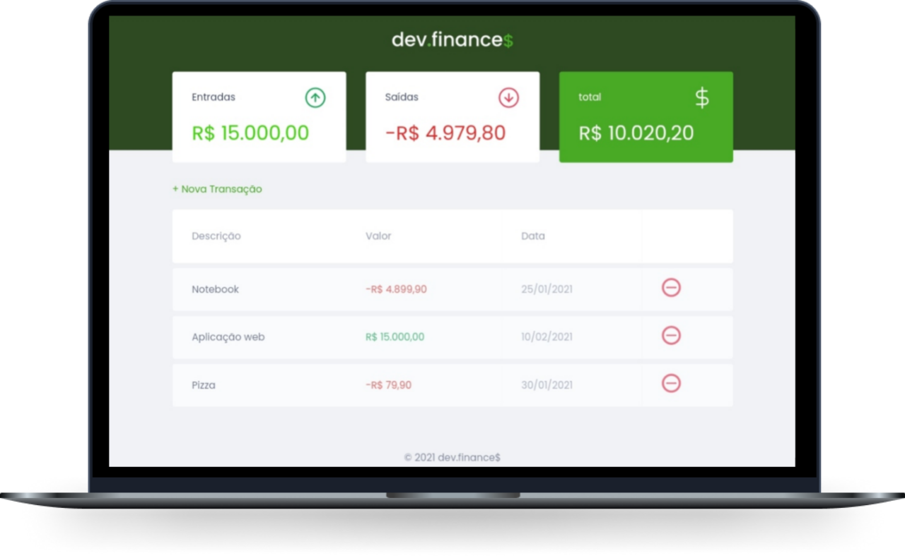

<h1 align="center">
  
</h1>

  <a href="#-tecnologias">Tecnologias</a>&nbsp;&nbsp;|&nbsp;&nbsp;
  <a href="#-projeto">Projeto</a>&nbsp;&nbsp;|&nbsp;&nbsp;
  <a href="#-minhas-alterações">Minhas alterações</a>

 

  

## 📌 Tecnologias

Projeto foi desenvolvido com as seguintes tecnologias:

- HTML
- CSS
- JavaScript

## 📌 Projeto

Uma aplicação para controle financeiro. 
Controle as tranasações de entrada e saida e veja o saldo final.

## 🔧 Minhas alterações
- Home
	- Animação ao colocar cursor nos elementos
- Modal
	- Botões de seleção de entrada ou saida
